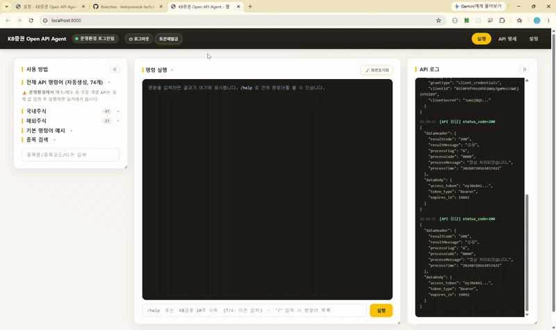
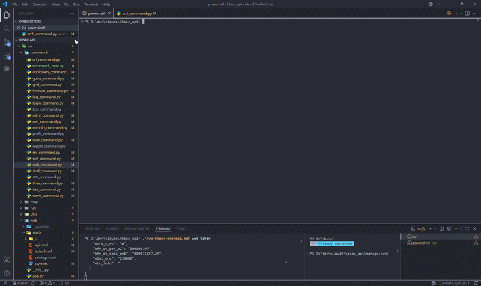

# kbsec_api — KB증권 OpenAPI 텔레그램 자동매매 Agent

<p align="center">
  
  
</p>
<p align="center"><sub>왼쪽: 웹 브라우저 실행 화면 · 오른쪽: 터미널 실행 화면</sub></p>

KB증권 [OpenAPI](https://developer.kbsec.com)(REST, 74개 API)를 활용한 **텔레그램 기반 자동매매 시스템**입니다.
텔레그램/터미널/웹 브라우저에서 명령어(또는 자연어)로 조회·매매·자동매매 전략을 실행할 수 있습니다. API 호출 코드는
명세서(md)로부터 **자동 생성**되어, 명세가 바뀌어도 스크립트 재실행만으로 갱신됩니다.

> ⚠️ **투자 위험 고지 — 반드시 읽어주세요**: **KB증권은 아직 개발환경(모의투자)을 제공하지 않아, 이 프로그램은 운영환경(실거래)에서만 동작합니다.** 즉 모든 명령·자동매매 전략이 실제 계좌로 즉시 주문을 전송합니다. 별도의 "안전한 연습 환경"이 없으므로, 반드시 소액/소수량으로 직접 하나씩 테스트하며 시작하고, 자동매매(gdcrs/ddcrs/trst/stls/brk/wave/grid)는 설정값을 충분히 검토한 뒤 활성화하세요. 모든 투자 책임은 사용자에게 있습니다.

---

## 🚀 시작하기

### 0. 소스 코드 받기 — GitHub이 처음이신가요?

Git이나 GitHub을 몰라도 괜찮습니다. 아래 링크를 클릭하면 소스 코드 전체가 압축파일(zip)로 바로 다운로드됩니다.

**➡️ [소스 코드 다운로드 (zip)](https://github.com/leehyunseok-tech/kbsec_openapi_trading/archive/refs/heads/master.zip)**

1. 위 링크를 클릭하면 `kbsec_openapi_trading-master.zip` 파일이 바로 다운로드됩니다(별도 로그인/가입 불필요).
2. 다운로드된 zip 파일을 **마우스 오른쪽 클릭 → "압축 풀기"**(Windows) 또는 더블클릭(macOS)으로 압축을 풉니다.
3. 압축이 풀린 `kbsec_openapi_trading-master` 폴더로 들어갑니다. **이후 모든 명령/스크립트는 이 폴더 안에서 실행합니다.**
4. 아래 "1. 원클릭 설치"로 이어서 진행하세요.

> 💡 Git에 익숙하다면 `git clone https://github.com/leehyunseok-tech/kbsec_openapi_trading.git`으로 받아도 동일합니다.

### 1. 원클릭 설치 (권장)

GitHub에서 처음 받은 상태라면 설치 스크립트 하나로 개발환경 전체(uv 설치 → 의존성 설치 → `config/config.py` 템플릿 생성)가 준비됩니다. **Python만 미리 설치되어 있으면 됩니다** — 없으면 스크립트가 [python.org 다운로드 링크](https://www.python.org/downloads/)를 안내하고 종료합니다.

```bash
manage\install\install-project.bat      # Windows
./manage/install/install-project.sh     # macOS / Linux (최초 1회: chmod +x manage/install/install-project.sh)
```

설치가 끝나면 `config/config.py`에 실제 키만 채우고 `manage/run/run-*.bat`/`manage/run/run-*.sh`로 바로 실행할 수 있습니다. 이미 설치된 환경에서 다시 실행해도 안전합니다(있는 것은 건너뜀). 수동으로 설치하려면 아래 2~3단계를 따르세요.

### 2. 사전 요구사항

- **Python** — https://www.python.org/downloads/ (Windows는 설치 시 "Add python.exe to PATH" 체크)
- **uv** (파이썬 패키지 관리자) — 설치: `winget install --id=astral-sh.uv -e` (install-project 스크립트가 자동 설치해 줌)
- KB증권 개발자포털에서 발급받은 **앱키(client_key) / 앱시크릿(client_secret)**
- (텔레그램 Agent 사용 시) 텔레그램 봇 토큰([@BotFather](https://t.me/BotFather)) 및 Chat ID
- (자연어 명령 사용 시, 선택) [Anthropic API Key](https://platform.anthropic.com)

### 3. 의존성 설치

```bash
uv sync
```

### 4. 설정 (`config/config.py`)

`config/config.example.py`를 복사해 `config/config.py`를 만들고 본인의 키를 입력하세요.

```python
# 운영환경 호스트 URL (변경 불필요)
real_host_url = "https://developer.kbsec.com:32484"

# KB증권 홈페이지에서 발급받은 앱키/앱시크릿 (필수 — 이것만 있으면 됩니다)
real_client_key = "실전용_앱키"
real_client_secret = "실전용_앱시크릿"

# (선택) 텔레그램 Agent — src/run/main.py(운영용 Agent) 사용 시 필요, src/run/terminal.py만 쓰면 불필요
telegram_token = "텔레그램_봇_토큰"
telegram_chat_id = "텔레그램_챗ID"

# (선택) 자연어 명령 변환 — 없으면 자연어 입력 시 안내 메시지만 반환
claude_api_key = "Claude_API_키"
claude_model = "claude-haiku-4-5-20251001"

# dev_host_url / dev_client_key / dev_client_secret 필드도 config.example.py에 남아있지만
# KB증권 개발환경(모의투자)이 아직 제공되지 않아 채워도 사용되지 않습니다 (참고용).
```

> 🔒 `config/config.py`는 `.gitignore`로 제외되어 있어 커밋되지 않습니다. **절대 키를 공개 저장소에 올리지 마세요.**

### 5. 실행

```bash
# 개발/테스트: 터미널에서 직접 명령 입력 (텔레그램 불필요) — 가장 빠른 시작 방법
uv run python -m src.run.terminal

# 운영: 텔레그램 Agent (무한 폴링, telegram_token/telegram_chat_id 필요)
uv run python -m src.run.main

# 웹: 브라우저 인터페이스 (http://localhost:8000, 다중 사용자 지원)
uv run python -m src.run.web
```

> `src/run/main.py`·`src/run/terminal.py`는 반드시 `-m src.run.<모듈>` 형태(모듈 실행)로 실행해야 합니다.
> `python src/run/main.py`처럼 파일 경로로 직접 실행하면 `from src...` 임포트가 깨집니다. 아래 실행
> 스크립트를 쓰면 이 부분을 신경 쓸 필요 없습니다.

`src/run/main.py`와 `src/run/terminal.py`는 `src/commands/*.py`의 **동일한 명령 핸들러를 공유**합니다 — 텔레그램 없이
`terminal.py`에서 먼저 명령을 테스트한 뒤, 그대로 텔레그램 Agent에서도 사용할 수 있습니다.

#### 실행 스크립트 (bat/sh)

매번 `uv run python ...`를 치기 번거로우면 아래 스크립트를 사용하세요 — 내부에서 동일하게 `uv run python`을 호출하므로 가상환경을 미리 활성화할 필요가 없습니다.

모든 실행/설치 스크립트는 `manage/` 아래(운영 스크립트 폴더, 자세한 구조는 [docs/개발환경/manage.md](docs/개발환경/manage.md) 참고)에 모여 있습니다.

| 스크립트 | 대상 OS | 역할 | 실행 대상 |
|---|---|---|---|
| `manage/run/run-terminal.bat` | Windows 전용 | 터미널 클라이언트 실행 | `src/run/terminal.py` |
| `manage/run/run-main.bat` | Windows 전용 | 텔레그램 Agent 실행 | `src/run/main.py` |
| `manage/run/run-web.bat` | Windows 전용 | 웹 클라이언트 실행 | `src/run/web.py` |
| `manage/run/run-terminal.sh` | macOS·Linux 전용 | 터미널 클라이언트 실행 | `src/run/terminal.py` |
| `manage/run/run-main.sh` | macOS·Linux 전용 | 텔레그램 Agent 실행 | `src/run/main.py` |
| `manage/run/run-web.sh` | macOS·Linux 전용 | 웹 클라이언트 실행 | `src/run/web.py` |

```bash
# Windows (탐색기에서 더블클릭해도 됨)
manage\run\run-terminal.bat
manage\run\run-main.bat
manage\run\run-web.bat

# macOS / Linux
./manage/run/run-terminal.sh
./manage/run/run-main.sh
./manage/run/run-web.sh
```

> 처음 한 번은 `chmod +x manage/run/run-terminal.sh manage/run/run-main.sh manage/run/run-web.sh`로 실행 권한을 부여해야 할 수 있습니다 (macOS/Linux, `install-project.sh`를 실행했다면 이미 부여되어 있습니다). Windows에서는 필요 없습니다.

---

## ✨ 주요 기능

- **삼중 클라이언트**: `src/run/main.py`(텔레그램 Agent, 운영용) / `src/run/terminal.py`(터미널, 개발·테스트용) / `src/run/web.py`(웹 브라우저, 다중 사용자) — 동일한 명령 핸들러 공유
- **자연어 명령**: Claude AI가 "KB금융 10주 사줘" → `buy 105560 10`으로 변환 (실행 전 확인 필요)
- **조회**: 현재가(국내+미국), 랭킹, 계좌현황, 종목마스터/검색(로컬 파일), 투자자별 매매 차트(국내 전용)
- **매매**: 시장가/지정가/금액기반 매수, 전량/부분 매도, 미체결 취소 (국내 + 미국 주식, 티커로 매매 가능. 해외는 보유수량 자동조회 미지원이라 매도 시 수량 필수)
- **자동매매 전략**: 골든/데드크로스, 트레일링 스탑, 자동 손절/익절, 돌파매수, 분할매매, 그리드 트레이딩 (모두 REST 폴링 기반 — KB API에 실시간 웹소켓이 없음)
- **예약/기록**: 명령 예약 실행, 체결 CSV 로그, Claude 기반 거래 분석, 일일 요약 자동 전송

KB API에는 대응 기능이 없어 **지원하지 않는 것**: 조건검색식 실시간거래, VI감시, 테마분석, 공매도분석
(전체 기능 목록은 [docs/features.md](docs/features.md) 참고).

---

## 📁 어떤 파일을 봐야 하나요? (파일 가이드)

| 알고 싶은 것                                             | 봐야 할 파일                                                                                                             |
| -------------------------------------------------------- | ------------------------------------------------------------------------------------------------------------------------ |
| **전체 API 목록** (코드/이름/URL)                  | [docs/api/api-list.md](docs/api/api-list.md) — 사람/AI용 표[docs/api/api-list.json](docs/api/api-list.json) — 프로그램용 |
| **특정 API의 상세 명세** (파라미터/응답 필드/예시) | [docs/api/md/](docs/api/md/) 아래 해당 API 코드로 시작하는 `.md` 파일예: `GSS10030-현재가-*.md`                       |
| **API를 호출하는 파이썬 함수**                     | [src/api/](src/api/) 아래 카테고리별 모듈 (아래 표 참고)                                                                          |
| **어떤 코드가 어떤 모듈에 있는지**                 | [src/api/registry.py](src/api/registry.py)의 `REGISTRY` 또는 CLI의 `list` 명령                                                |
| **인증(토큰 발급) 로직**                           | [src/api/auth.py](src/api/auth.py)                                                                                                |
| **공통 요청 봉투(dataHeader/dataBody) 구성**       | [src/api/client.py](src/api/client.py)                                                                                            |
| **앱키/시크릿 설정**                               | [config/config.py](config/config.py) (없으면 `config.example.py` 복사)                                                  |
| **터미널에서 바로 테스트**                         | [src/run/terminal.py](src/run/terminal.py) (또는 `manage/run/run-terminal.bat`/`manage/run/run-terminal.sh`로 바로 실행)                                      |
| **텔레그램 Agent 원클릭 실행**                     | `manage/run/run-main.bat`(Windows) / `manage/run/run-main.sh`(macOS·Linux)                                                                     |
| **웹 브라우저에서 사용**                           | `manage/run/run-web.bat`/`manage/run/run-web.sh` 실행 후 http://localhost:8000 접속 ([src/web/](src/web/) — FastAPI + 순수 HTML/JS)              |
| **코드 생성 방법/규칙**                            | [manage/generate/generate_api_client.py](manage/generate/generate_api_client.py), [docs/api/README.md](docs/api/README.md)               |
| **개발 환경(uv 등) 안내**                          | [docs/개발환경/개발환경.md](docs/개발환경/개발환경.md)                                                                        |
| **슬래시(`/`) 명령어 요약/예시**                    | [docs/개발환경/command_summary.md](docs/개발환경/command_summary.md)                                                        |
| **운영/관리 스크립트(`manage/`) 설명·실행 시점** | [docs/개발환경/manage.md](docs/개발환경/manage.md)                                                                  |
| **텔레그램 Agent 명령어 전체 목록**                | [src/run/main.py](src/run/main.py)의 `HELP_TEXT`, 또는 Agent/CLI에서 `help` 입력                                                      |
| **명령 핸들러 구현체**                             | [src/commands/](src/commands/) — 파일 1개 = 명령 1개                                                           |
| **AI 자연어 → 명령어 변환 규칙**                  | [docs/command_guide_for_ai.md](docs/command_guide_for_ai.md) (런타임에 실제로 참조되는 문서)                                            |
| **자동매매 전략(폴링 모니터) 구현체**              | [src/utils/monitor_base.py](src/utils/monitor_base.py) + `src/utils/*_monitor.py`                                                   |
| **전체 기능 목록/현황**                            | [docs/features.md](docs/features.md)                                                                                      |
| **다른 코딩 에이전트용 Agent Skill 패키지**        | [agent-skill/](agent-skill/) — Claude Code/Codex 등이 KB증권 Open API를 바로 쓰도록 만든 별도 배포용 패키지(장기적으로 별도 공개 저장소로 분리 예정), 자체 문서(`agent-skill/README.md`) 참고 |

### src/api/ 모듈별 담당 API

| 모듈                                          | 담당                             | 포함 API 코드                                                                                      |
| --------------------------------------------- | -------------------------------- | -------------------------------------------------------------------------------------------------- |
| [src/api/auth.py](src/api/auth.py)                     | 토큰 발급 (수기 작성)            | `/oauth2/token`                                                                                  |
| [src/api/price_info.py](src/api/price_info.py)         | 시세 (현재가/호가/체결/시장종합) | GSS10030, GSS10040, GSA10020, IVU10070, IVU10080, IVU10140, IVSA0070                               |
| [src/api/rank_info.py](src/api/rank_info.py)           | 순위/상위 조회                   | GSA10150, GSA10170, IVS10910, IVS11190, IVU10210, IVU10240, IVU10270, IVU10280, IVU10550, IVM30010 |
| [src/api/chart.py](src/api/chart.py)                   | 통합차트                         | GSC10060, IVS11560                                                                                 |
| [src/api/stock_info.py](src/api/stock_info.py)         | 종목 기본정보/기업개요           | SIAM4983, SIQM4900, IVM10050                                                                       |
| [src/api/market_info.py](src/api/market_info.py)       | 시장/거시 정보                   | IVA10370, IVA60140, IVA60190, SZQM0771, GSA10600                                                   |
| [src/api/investor_chart.py](src/api/investor_chart.py) | 거래원/투자자/프로그램           | IVU10420, IVU10430, IVU10450                                                                       |
| [src/api/order.py](src/api/order.py)                   | 매매주문 (국내/해외, 소수점)     | SSAM1801~1806, SSAM5762~5764, SKAM2101~2202                                                       |
| [src/api/reserve_order.py](src/api/reserve_order.py)   | 예약주문 (국내/미국)             | SSAM0831, SSQM0831, SSQM0834, SPAO2104, SPAO2106, SPQO2105                                         |
| [src/api/account.py](src/api/account.py)               | 계좌/잔고/손익/예수금            | SSQM*, SPQM*, SPQN5472, SPQO2226, SRQM3051, SKQM*, SKQO3390 (23개)                                 |
| [src/api/withdraw.py](src/api/withdraw.py)             | 거래내역/출금가능금액            | SWQA2301, SWQM2412, SWQN2302                                                                       |

> `src/api/` 아래에서 `client.py`, `auth.py`, `__init__.py`를 **제외한 모든 파일은 자동 생성**됩니다. 직접 수정하지 마세요 (재생성 시 덮어써짐).

---

## 🌐 웹 클라이언트 사용법

`manage/run/run-web.*`(또는 `uv run python -m src.run.web`)을 실행하고 브라우저에서 http://localhost:8000 에 접속합니다.
프론트엔드는 프레임워크 없이 **순수 HTML + CSS + JS(fetch)**, 백엔드는 FastAPI JSON API로만 구성되어 있습니다 (`src/web/`).

- **다중 사용자**: 브라우저(쿠키)마다 독립 세션이 만들어져, 여러 사람이 같은 서버에 접속해 **각자 자기 앱키로** 로그인/매매할 수 있습니다.
- **별도 로그인 화면 없음**: "설정" 화면에서 KB증권 **앱키(client_key)/앱시크릿(client_secret)** (필수)을 입력하고 저장하면 즉시 로그인됩니다. 거래 환경(운영/개발)도 여기서 선택합니다 (개발환경은 KB증권 미제공으로 현재 동작하지 않음). Claude API 키·텔레그램 토큰은 선택 입력입니다.
- **입력한 키는 서버 메모리에만** 보관됩니다 — 파일로 저장되지 않으며, 서버를 재시작하면 다시 입력해야 합니다. 서버는 시크릿 원문을 응답으로 되돌려주지 않습니다.
- **명령 입력은 터미널/텔레그램과 동일**: `/`로 시작하면 즉시 실행, `/` 없이 입력하면 AI 자연어 변환 후 확인. 확인/선택이 필요하면 화면에 버튼이 뜹니다 (터미널의 화살표 메뉴, 텔레그램의 인라인 버튼과 같은 역할). 화면 상단의 사용 방법 카드에서 예시 명령을 클릭하면 입력창에 자동으로 채워집니다. 명령 입력창에서 **↑/↓** 키로 이전에 입력한 명령을 다시 불러올 수 있습니다.
- **실행 화면 상태 유지**: 명령 출력 이력·입력 히스토리(↑/↓)·진행 중이던 확인/선택 프롬프트는 "API 명세"/"설정"으로 이동했다가 돌아오거나 새로고침해도 그대로 유지됩니다(같은 브라우저 탭 기준, 탭을 닫으면 사라짐). 로그인/토큰도 세션 쿠키로 유지되어 페이지를 오가도 다시 발급받지 않습니다.
- **토큰재발급 / 로그아웃 / 화면초기화**: 로그인하면 상단 헤더(상태 배지 옆, 실행·API 명세·설정 모든 화면 공통)에 **🔑 토큰재발급**(마지막 로그인에 쓴 앱키로 새 토큰 발급)과 **⏻ 로그아웃**(KB 토큰폐기 API로 토큰을 즉시 무효화하고 화면·히스토리 초기화. 로그아웃 후에는 `token` 모드라도 자동 재로그인되지 않으며, 설정 화면에서 다시 로그인) 버튼이 나타납니다. **🧹 화면초기화**(출력창만 비움 — 로그인/토큰/히스토리는 유지)는 "명령 실행" 패널 제목줄 오른쪽에 항상 표시됩니다.
- **종목 검색창**: 두 글자 이상 입력하면 글자를 칠 때마다 국내(종목명·종목코드)/해외(티커·이름) 종목이 실시간으로 검색됩니다 (예: "삼성전" → 삼성전기/삼성전자..., "IO" → IONQ..., 대소문자 무관 — "kb금융"도 KB금융 검색). 종목마스터는 서버 시작 시 메모리에 미리 로드되어 빠르게 응답하고, 검색 결과를 클릭하면 그 종목만 목록에 남고 명령 입력창에 종목코드가 들어갑니다(↑/↓ 이동 후 Enter 선택도 동일). 하이라이트 없이 Enter를 누르면 정확일치 종목만 표시됩니다. 자연어 명령("KB금융 10주 사줘")을 입력하는 동안에는 입력창 아래에 인식된 종목(KB금융 105560)이 칩으로 표시됩니다.
- **API 명세 탐색/테스트 (`/api.html`)**: `docs/api/md`의 업무구분 폴더 구조(OAuth/국내주식/해외주식 → 계좌잔고/기본시세/...)를 그대로 트리로 탐색하면서 명세 문서를 웹에서 읽고, INPUT 파라미터가 기본값으로 채워진 폼을 수정해 **실제 KB API를 테스트 호출**하고 원본 JSON 응답을 확인할 수 있습니다. `dataHeader`(ipAddr/macAddr)는 일반 주문/조회와 동일하게 서버가 자동 구성합니다. ⚠️ 운영환경(실거래)이므로 주문 계열(SSAM/SKAM) API는 전송 전에 확인 대화상자와 경고가 표시됩니다.
- **주의(서버 공용 데이터)**: 로그인/토큰/자동매매 모니터 스레드는 사용자별로 분리되지만, 설정값(익절·손절, 블랙리스트 등)과 자동매매 감시목록(`config/data/settings.json`)은 **서버 전체 공용**입니다. 여러 사람이 쓸 때는 자동매매 기능 사용을 조율하세요.
- **호스트/포트 변경**: 환경변수 `KBSEC_WEB_HOST`(기본 `127.0.0.1` — 로컬 전용) / `KBSEC_WEB_PORT`(기본 `8000`). 같은 네트워크의 다른 기기나 클라우드 배포 시 `KBSEC_WEB_HOST=0.0.0.0`으로 실행하되, 반드시 신뢰할 수 있는 네트워크(VPN 등)나 인증 프록시 뒤에서만 노출하세요 — 웹 화면 자체에는 접근 인증이 없습니다.
- **로컬 1인 사용 편의 — `token` 옵션**: `manage\run\run-web.bat token`(Windows) / `./manage/run/run-web.sh token`(macOS·Linux)으로 실행하면 `config/config.py`의 앱키(client_key/client_secret)와 선택 항목(Claude API 키, 텔레그램 토큰)으로 새 브라우저 세션이 자동으로 설정·로그인되고, 브라우저가 실행 화면(`/`)으로 자동으로 열립니다 — 매번 값을 다시 입력할 필요가 없습니다. 다만 이 옵션은 "설정 화면에서 각자 자기 키를 입력"하는 다중 사용자 원칙의 예외라서, **접속하는 모든 브라우저가 운영자의 실제 KB 계정으로 자동 로그인됩니다** — 반드시 로컬(`127.0.0.1`)에서 혼자 쓸 때만 사용하고, `KBSEC_WEB_HOST=0.0.0.0` 등으로 외부에 노출된 상태에서는 절대 켜지 마세요. 자동 설정 후에도 설정 화면의 입력칸 자체에는 시크릿 원문이 표시되지 않습니다(다중 사용자 모드와 동일하게, 응답으로 시크릿을 절대 돌려주지 않는 설계를 그대로 유지) — 로그인 상태만 즉시 반영됩니다.

---

## 🤖 텔레그램 Agent / 터미널 명령어 사용법

> **`/`로 시작 = 명확한 커맨드(AI 없이 즉시 실행), `/` 없이 입력 = 자연어(무조건 Claude로 변환 후 확인)입니다.**
> 예를 들어 `/buy 005930 10`은 곧바로 매수 주문을 실행하지만, `buy 005930 10`처럼 `/` 없이 입력하면
> "buy"가 실제 명령어 이름과 같아도 자연어로 취급되어 Claude를 거칩니다 — 두 방식을 헷갈리지 않게
> 판단 기준을 오직 `/` 유무 하나로 통일했습니다.

### 기본 흐름

`manage/run/run-terminal.*`/`manage/run/run-main.*`은 시작하자마자 **운영환경으로 자동 로그인**합니다 (KB증권 모의투자가
아직 없어 `login`을 직접 입력할 필요가 없습니다 — 실패하면 결과 메시지가 표시되니 그때 `/login real`로
재시도하면 됩니다).

```
🔐 운영환경 자동 로그인 중...
✅ 운영환경 로그인 성공!

>>> /srch 005930
📈 삼성전자 (005930)
현재가: 71,000원 ...

>>> /buy 005930 10
✅ 매수주문 접수
...

>>> /report
📊 보유 종목
  삼성전자(005930)  주문가능수량 10주
...
```

전체 명령어는 `/help` 입력 시 확인할 수 있습니다 (조회 / 매매 / 설정 / 예약·기록 / 자동매매 카테고리별로 정리됨).

### 해외(미국) 주식 매매하기

`srch`/`buy`/`sell`은 종목코드 자리에 국내 6자리 코드 대신 **미국 티커**를 입력하면 자동으로 해외 주문(`SKAM2101`)/시세조회(`GSS10030`)로 전환됩니다.

```
>>> /srch IONQ
📈 아이온큐 (IONQ)  [NYS]
현재가: 12.34 USD  (₩17,500) ...

>>> /buy IONQ 10
✅ 해외 매수주문 접수
IONQ  시장가(현재가 $12.34 기준)  10주 ...
```

- 가격을 생략하면(시장가) 현재가를 조회해 그 가격으로 지정가 주문을 넣습니다 — KB 명세에 해외 시장가 주문의 가격 필드 처리 방식이 명시되어 있지 않아 택한 방식입니다.
- **해외 매도는 수량을 반드시 입력해야 합니다** (`/sell IONQ 5`). KB API 74개 전체에 종목별 해외 보유수량 조회 API가 없어 `sell all`/전량 매도(수량 생략)는 지원하지 않습니다.
- `investor`(투자자별 매매 차트)는 KB에 해외 버전 API가 없어 국내 전용입니다.
- 블랙리스트(`/blacklist add IONQ`)·쿨다운은 해외 티커에도 적용됩니다.

### 자연어로 명령하기 (Claude API 키 설정 시)

```
>>> KB금융 10주 사줘

다음 명령어를 실행할까요?

`buy 105560 10`
[Enter] 실행   [다른 키] 취소
```

**실행 확인은 `Enter` 한 번**으로 합니다(다른 키를 누르면 취소). 종목/API 검색 결과가
여러 건이라 하나를 골라야 할 때는 화살표 `↑`/`↓`로 이동해 `Enter`로 확정하거나, 후보
번호를 그대로 입력해 바로 선택할 수 있습니다(터미널 기준). 텔레그램에서는 같은 상황에
인라인 버튼이 붙어서 나와 탭으로 확인/선택합니다.

자연어 → 명령어 변환 규칙은 [docs/command_guide_for_ai.md](docs/command_guide_for_ai.md)에 정리되어 있으며, Claude API가 이 문서를
그대로 참조합니다. **명령어를 추가/변경하면 이 문서도 함께 갱신해야** AI가 올바르게 변환합니다.

### 자동매매 전략 시작하기

```
>>> /gdcrs intv 5 20              # 골든크로스: 5분/20분 이동평균 교차 감지 설정
>>> /gdcrs add 005930 100000      # 삼성전자, 교차 시 10만원어치 매수
>>> /start gdcrs                  # 감시 시작 (09:00~15:30, 20초 폴링)
...
>>> /stop gdcrs                   # 감시 중단
```

지원 전략: `gdcrs`(골든크로스) `ddcrs`(데드크로스) `trst`(트레일링 스탑) `stls`(자동 손절/익절)
`brk`(돌파매수) `wave`(분할매매) `grid`(그리드 트레이딩) `hold`(보유종목 변경감지) —
`/start {기능}` / `/stop {기능}`으로 제어합니다. 자세한 설정 명령은 `/help` 참고.

---

## 💻 CLI 저수준 직접 호출 (docs/api/md 명세 기반)

`docs/api/md`에 문서화된 API라면(74개 전체) 코드만 알면 곧바로 호출할 수 있습니다.
지정하지 않은 필드는 자동으로 타입(길이)만큼 공백(`" "`)으로 채워 요청하므로,
관심 있는 필드만 값을 넣으면 됩니다 — 필수 파라미터를 전부 알아야 하는 부담이 없습니다.

### 명령어 요약

| 명령어                    | 설명                                      |
| ------------------------- | ----------------------------------------- |
| `/login real`           | 운영환경 로그인 (토큰 발급) — KB증권 개발환경(모의투자)은 아직 미제공 |
| `/list [키워드]`        | API 코드/이름/업무구분 검색 (키워드 생략 시 전체 74개) |
| `/info <API코드>`       | 해당 API의 파라미터(타입/길이/필수여부/선택지) 미리보기 |
| `/call <API코드> ['<json>']` | 지정한 필드만 값을 채워 API 호출, 나머지는 공백 자동 입력 |
| `/api <API코드>`        | `/call`과 달리 필수+선택지 있는 필드는 대화형으로 번호 선택하며 실행 (텔레그램 자연어로도 이름으로 실행 가능 — `/help` 참고) |
| `/help`                 | 도움말                                    |
| `/power off` / `exit` / `quit` | 종료                                |

### 사용 예시 — 기본 흐름

`manage/run/run-terminal.*`로 실행하면 자동 로그인이 이미 되어 있으니 바로 명령을 입력하면 됩니다:

```
>>> /info SZQM0771
📋 SZQM0771 장운영상태  [국내주식 > 기본시세]
엔드포인트: /api/v1/szqm0771

INPUT 파라미터 없음 — 바로 실행 가능합니다.

/api SZQM0771 로 실행하세요.
원하는 필드만 지정해 호출: /call SZQM0771 {"필드명":"값"}

>>> /call SZQM0771 {}
{
  "status_code": 200,
  "body": { "dataHeader": {...}, "dataBody": { "jb_clsng_f": "영업중", ... } },
  "success": true
}
```

### 사용 예시 — 종목 조회/주문 (필요한 필드만 지정)

```
# 해외주식 현재가 (NASDAQ의 NVDA)
>>> /call GSS10030 {"krx_cd": "NAS", "is_cd": "NVDA"}

# 국내주식 매도주문: 삼성전자 1주, 지정가 320,000원 — 시장시간구분/주문구분코드는
# 지정하지 않으면 공백으로 채워지므로, 정확한 값이 필요하면 함께 넣어야 합니다
>>> /call SSAM1801 {"mkt_tm_clsf":"1", "is_cd":"005930", "ordr_q":"1", "ordr_uprc":"320000", "ordr_ccd":"00"}

# 보유주식 조회 — 어떤 필드가 있는지 먼저 확인하고 필요한 것만 지정
>>> /info SSQM1801
>>> /call SSQM1801 {}
```

알 수 없는 필드명을 쓰면 네트워크 호출 전에 알려줍니다:

```
>>> /call SSAM1801 {"존재안함":"x"}
❌ 알 수 없는 파라미터: 존재안함 (/info SSAM1801 로 사용 가능한 필드를 확인하세요)
```

---

## 🐍 파이썬 코드에서 사용하기

### 기본 사용

```python
from config import config
from api.auth import get_token
from api.market_info import szqm0771

# 1. 토큰 발급 (운영환경 — KB증권 개발환경/모의투자는 아직 미제공)
auth = get_token(config.real_host_url, config.real_client_key, config.real_client_secret)
assert auth["success"], auth["body"]
token = auth["access_token"]

# 2. API 호출 — 장운영상태 조회
result = szqm0771(token=token, host_url=config.real_host_url)
if result["success"]:
    print(result["body"]["dataBody"]["jb_clsng_f"])   # 예: "영업중"
```

> ⚠️ 위 예제는 **운영환경(실거래)** 을 사용합니다. `token`을 이용하는 모든 호출은 실제 계좌에 반영됩니다.

### 시세 조회 예시

```python
from api.price_info import gss10030   # 해외주식 현재가

result = gss10030(krx_cd="NAS", is_cd="NVDA", token=token, host_url=config.real_host_url)
body = result["body"]["dataBody"]
print(f"현재가: {body['now_prc_p4']}, 등락율: {body['up_dwn_r_p2']}%")
```

### 주문 예시

```python
from api.order import ssam1801   # 매도주문 — 실제 계좌로 즉시 전송되니 수량/가격을 반드시 확인하세요

result = ssam1801(
    mkt_tm_clsf="1",      # 1:정규장
    is_cd="005930",       # 삼성전자
    ordr_q="1",           # 1주
    ordr_uprc="320000",   # 지정가 320,000원
    ordr_ccd="00",        # 00:지정가
    token=token,
    host_url=config.real_host_url,
)
print(result["body"]["dataBody"].get("ordr_no"))   # 주문번호
```

### API 코드로 동적 호출 (registry)

```python
from api.registry import REGISTRY

entry = REGISTRY["SSQM0004"]           # 예수금내역
print(entry["name"], entry["required"])  # 필요한 파라미터 확인
result = entry["function"](token=token, host_url=config.real_host_url)
```

### 반환값 형식 (모든 API 공통)

```python
{
    "status_code": 200,        # HTTP 상태코드 (오류 시 None)
    "body": {                  # KB 응답 전체
        "dataHeader": {"resultCode": "200", "resultMessage": "성공", ...},
        "dataBody": {...},     # 실제 데이터
    },
    "success": True,           # HTTP 200 이면서 resultCode == "200" 일 때만 True
}
```

- INPUT 표에 없는 필드를 보내야 하면 `extra={"필드명": "값"}` 인자를 사용하세요.
- 요청/응답은 모두 콘솔에 자동 로깅됩니다 (토큰은 앞 50자만 표시).

---

## 🔧 코드 생성 파이프라인 (명세 변경 시)

```
docs/api/xlsx/*.xlsx  ──convert_xlsx_to_md.py──▶  docs/api/md/*.md
                                                      │
                    ┌─────────────────────────────────┤
                    ▼                                 ▼
  manage/generate/generate_api_list.py     manage/generate/generate_api_client.py
     (api-list.md / api-list.json)              (src/api/*.py + registry.py)
```

**위 3개 스크립트는 전부 `docs/api/`가 아니라 `manage/generate/`에 있습니다**(순수 관리
스크립트라 프로젝트 루트의 `manage/` 폴더에 둠 — 상세는 [docs/개발환경/manage.md](docs/개발환경/manage.md) 참고).
KB에서 새 명세를 받았거나 기존 명세가 바뀌면:

```bash
uv run python -m manage.generate.convert_xlsx_to_md "docs/api/xlsx/"   # xlsx → md 변환
uv run python -m manage.generate.generate_api_list                     # 목록 갱신
uv run python -m manage.generate.generate_api_client                   # 호출 코드 재생성
```

(`manage/generate/generate_api_docs.py`는 위 세 단계 중 xlsx→md 변환과 목록 갱신 두 단계를 한 번에 실행하는 통합 스크립트입니다 — `uv run python -m manage.generate.generate_api_docs`.)

⚠️ **`docs/api/xlsx/`에 새 명세를 추가할 때는 반드시 TR 성격에 맞는 업무구분 폴더**(예:
`국내주식/계좌잔고/`)**안에 넣으세요** — 이 폴더 구조가 그대로 웹 "API 명세"(`/api.html`)
화면의 트리 분류로 표시됩니다.

새 API를 추가할 땐 `manage/generate/generate_api_client.py`의 `CODE_TO_MODULE` 딕셔너리에 코드→모듈 배정을 추가해야 합니다 (누락 시 경고 출력 후 건너뜀).

### 종목마스터 갱신 (mst)

```
mst/origin/*.mst (KB 배포 원본)  ──┐
docs/mst/xlsx/mst_*.xlsx (공식 필드 명세) ──┤── manage/generate/generate_mst.py ──▶
docs/api/api-list.md (API 코드 검증) ──┘
    ├─ docs/mst/xlsx/openapi_mst_*.xlsx   (사용/참조 필드 선별표)
    ├─ docs/mst/md/openapi_mst_*.md       (선별표 md + 코드→라벨 변환 규칙)
    └─ mst/api/openapi_field_*.mst        (종목검색 런타임 데이터)
```

KB에서 새 종목마스터(`mtsjname.mst`/`mtsoutjname.mst`/`FORENMST_US.MST`)를 받았으면 `mst/origin/`에 덮어쓰고 한 번만 실행합니다:

```bash
uv run python -m manage.generate.generate_mst
```

---

## ❓ 자주 묻는 질문

**Q. `/`를 붙여야 할 때와 안 붙여야 할 때가 헷갈려요.**
기준은 오직 `/` 유무입니다. `/buy 005930 10`처럼 `/`로 시작하면 AI를 거치지 않고 곧바로 실행되는 명확한 명령이고, `buy 005930 10`처럼 `/` 없이 입력하면(단어가 실제 명령어와 같아도) 전부 자연어로 취급되어 Claude 변환 → 확인(`y`) 단계를 거칩니다. 빠르고 정확하게 실행하려면 `/`를, 편하게 문장으로 말하려면 `/` 없이 입력하세요.

**Q. `/login real`이 실패해요.**
`config/config.py`의 `real_client_key`/`real_client_secret`이 실제 발급값인지 확인하세요. KB 개발자포털에 등록된 IP에서만 호출이 허용될 수 있습니다.

**Q. `login dev`는 왜 없어요? / 모의투자로 테스트하고 싶어요.**
KB증권이 아직 개발환경(모의투자)을 제공하지 않습니다. 현재는 운영환경(실거래)만 사용할 수 있어 `/login real`만 안내하고 있습니다. `dev_host_url`/`dev_client_key` 관련 코드는 남아있으니, KB가 추후 개발환경을 열면 그대로 사용할 수 있습니다.

**Q. `success: false`인데 `status_code: 200`이에요.**
HTTP는 성공했지만 KB 쪽 처리 결과(`dataHeader.resultCode`)가 실패인 경우입니다. `body.dataHeader.resultMessage`/`processMessage`를 확인하세요.

**Q. 함수에 없는 파라미터를 보내야 해요.**
모든 생성 함수는 `extra` 인자를 지원합니다: `ssam1801(..., extra={"hts_pwd": "..."})`. 명세의 "요청 예시"에는 있지만 INPUT 표에 없는 필드(주문류 API에 흔함)를 보낼 때 사용하세요.

**Q. `src/api/order.py`를 직접 고쳤는데 사라졌어요.**
`src/api/` 아래 생성 파일은 `generate_api_client.py` 재실행 시 덮어써집니다. 공통 로직 수정은 `src/api/client.py`, 생성 방식 수정은 `manage/generate/generate_api_client.py`에서 하세요.

**Q. 자연어로 말했는데 "Claude API 키가 설정되지 않았습니다"라고 나와요.**
`config/config.py`의 `claude_api_key`를 실제 발급받은 키로 채우세요. 자연어 변환은 선택 기능이며, 키가 없어도 `/`로 시작하는 정식 명령어는 그대로 사용할 수 있습니다.

**Q. `gdcrs`/`trst` 같은 자동매매가 실제로 얼마나 자주 확인하나요?**
KB API에는 실시간 웹소켓이 없어 REST 폴링 방식입니다 — 전략별로 15~30초 주기로 확인하며, 장 시간(09:00~15:30, 평일)에만 동작합니다. 정확한 주기는 `docs/features.md` 참고.

**Q. 새 명령어를 추가하려면?**
`CLAUDE.md`의 "필수 규칙" 섹션을 따르세요 — 명령 핸들러, `src/run/main.py`/`src/run/terminal.py` 등록, `docs/command_guide_for_ai.md` 갱신을 모두 함께 해야 합니다.

---

## ⚖️ 면책 조항

본 소프트웨어는 "있는 그대로(as-is)" 제공되며, 사용으로 인한 어떠한 금전적 손실에도 작성자는 책임지지 않습니다. 실제 투자에 따른 모든 결정과 결과는 전적으로 사용자 본인에게 있습니다.
