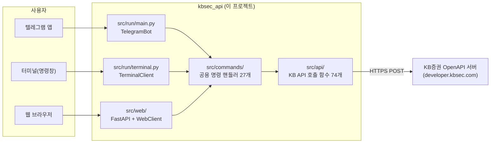
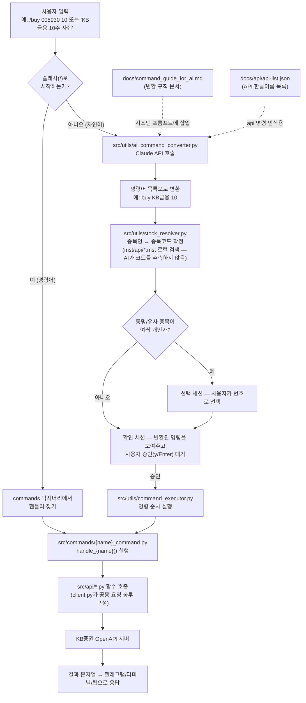
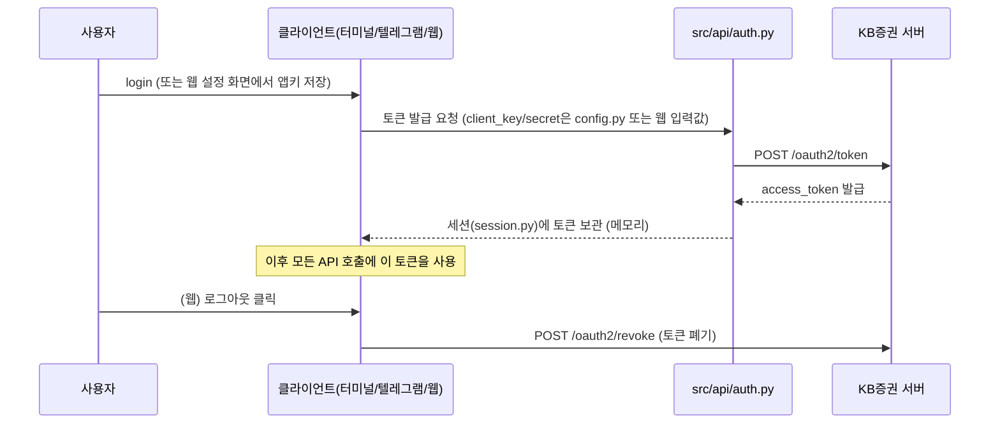
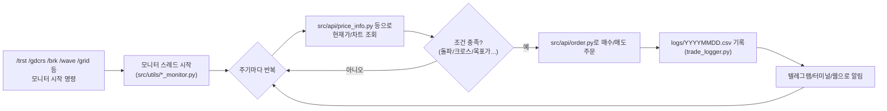
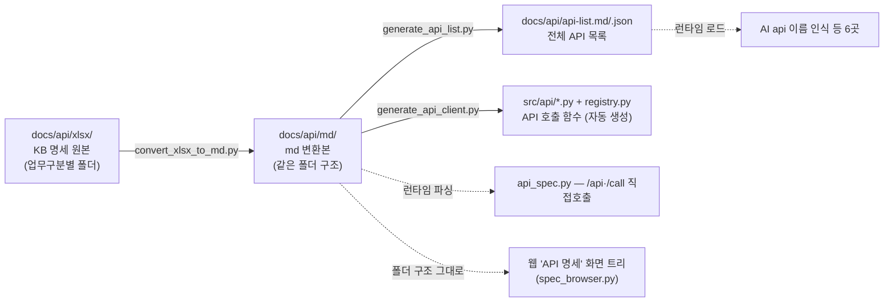
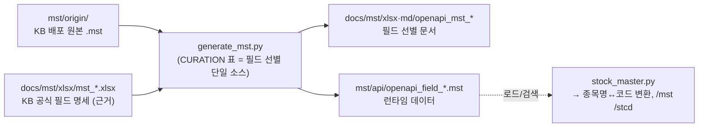
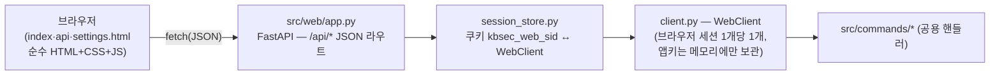

# 프로젝트 전체 구조와 흐름

> 이 문서는 kbsec_api 프로젝트의 **전체 구조(폴더/모듈)와 데이터 흐름**을 mermaid
> 다이어그램으로 정리한 것이다. 프로그래밍 용어가 낯설다면 먼저
> [초보자가이드.md](초보자가이드.md)를 읽고 오는 것을 권장한다.
> 개별 명령어 사용법은 [command_summary.md](command_summary.md), 관리 스크립트는
> [manage.md](manage.md), 경로 상수는 [paths.md](paths.md) 참고.

## 1. 한눈에 보는 프로젝트

KB증권 OpenAPI(REST)로 주식을 조회/주문하는 **자동매매 시스템**이다.
같은 명령어 처리 코드를 **텔레그램 / 터미널 / 웹** 세 가지 클라이언트가 공유한다
(트리플 클라이언트 아키텍처).

핵심: **어느 클라이언트로 들어와도 `src/commands/`의 같은 핸들러가 실행**되므로,
기능을 한 번만 만들면 세 클라이언트 모두에서 동작한다. 그래서 명령어를 추가/변경할
때는 세 클라이언트의 `commands` 딕셔너리에 모두 등록해야 한다(CLAUDE.md 필수 규칙).

## 2. 폴더 구조

```mermaid
flowchart TB
    ROOT["프로젝트 루트"]

    ROOT --> SRC["src/ — 실행(런타임) 코드"]
    ROOT --> MANAGE["manage/ — 운영/관리 스크립트"]
    ROOT --> CONFIG["config/ — 설정·런타임 상태"]
    ROOT --> DOCS["docs/ — 문서 (일부는 런타임 데이터 겸용)"]
    ROOT --> MST["mst/ — 종목마스터 데이터"]
    ROOT --> LOGS["logs/ — 체결 내역 CSV (자동 생성)"]

    SRC --> SRUN["run/ — 진입점 3개<br/>(main·terminal·web)+공용 파이프라인"]
    SRC --> SCMD["commands/ — 명령 핸들러<br/>(1파일=1명령)"]
    SRC --> SAPI["api/ — KB API 호출 함수<br/>(client·auth 외 전부 자동 생성)"]
    SRC --> SUTIL["utils/ — 유틸+자동매매 모니터"]
    SRC --> SWEB["web/ — FastAPI 서버+정적 프론트엔드"]
    SRC --> SMSGR["msgr/telegram/ — 텔레그램 송수신"]
    SRC --> SPATHS["paths.py — 경로 상수 단일 소스"]

    MANAGE --> MG["generate/ — 코드·데이터 생성 5종"]
    MANAGE --> MR["run/ — 실행 스크립트 (.bat/.sh)"]
    MANAGE --> MI["install/ — 신규 설치 스크립트"]

    DOCS --> DAPI["api/ — API 명세 (xlsx→md→api-list)"]
    DOCS --> DMST["mst/ — 종목마스터 필드 문서"]
    DOCS --> DGUIDE["command_guide_for_ai.md<br/>— AI 런타임 참조 규칙"]
    DOCS --> DENV["개발환경/ — 사람용 참고 문서"]

    MST --> MO["origin/ — KB 배포 원본"]
    MST --> MA["api/ — 가공된 런타임 데이터"]
```

| 폴더 | 역할 | 성격 |
|---|---|---|
| `src/` | 실제로 실행되는 모든 파이썬 코드 | 런타임 |
| `manage/` | 개발자가 필요할 때만 돌리는 생성/실행/설치 스크립트 | 운영 도구 |
| `config/` | API 키 등 비밀 설정(`config.py`, git 제외) + 런타임 상태(`data/*.json`) | 설정 |
| `docs/` | 문서. 단 `api/md`·`api-list.json`·`command_guide_for_ai.md`는 **프로그램이 런타임에 직접 읽는다** | 문서+데이터 |
| `mst/` | 종목마스터(전 종목 코드/이름 목록). `origin/` 원본 → `api/` 가공본 | 데이터 |
| `logs/` | 자동매매 체결 내역 CSV (`YYYYMMDD.csv`) | 산출물 |

## 3. 명령 처리 흐름 (핵심 동작)

사용자가 입력한 한 줄이 실행되기까지의 전체 흐름. 슬래시(`/`)로 시작하면 명령어로
직접 실행하고, 아니면 **자연어로 보고 AI(Claude)가 명령어로 변환**한 뒤 사용자
확인을 거쳐 실행한다.

이 "AI 변환 이후" 처리(종목명 해석 → 선택/확인 세션 → 일괄 실행)는
`src/run/command_pipeline.py`의 `CommandPipelineMixin` **한 곳에만** 구현되어 있고
세 클라이언트가 상속해 쓴다 — 파이프라인을 고칠 때는 이 파일만 고친다.

## 4. 로그인(토큰 발급) 흐름

KB API를 호출하려면 먼저 **접근 토큰(access token)** 이 필요하다.

## 5. 자동매매 모니터 흐름 (REST 폴링)

KB API에는 실시간 웹소켓이 없어서, 자동매매는 **일정 주기로 시세를 조회(폴링)** 하는
방식으로 동작한다. 모든 모니터는 `src/utils/monitor_base.py`를 상속한 백그라운드
스레드다.

모니터 종류: 트레일링 스탑(`trailing_stop_monitor`), 자동 손절/익절(`stoploss_manager`),
골든/데드크로스(`golden_cross_monitor`/`dead_cross_monitor`), 돌파매수(`brk_monitor`),
분할매매(`wave_monitor`), 그리드(`grid_monitor`), 보유종목 변경감지(`holdings_monitor`).

## 6. 데이터/코드 생성 파이프라인 (manage/generate)

런타임 코드가 참조하는 데이터와 `src/api/` 코드는 손으로 만들지 않고
**원본 → 스크립트 → 산출물** 파이프라인으로 생성한다. 산출물을 직접 고치면
재실행 시 덮어써지므로 **반드시 원본을 고치고 스크립트를 재실행**한다.

### 6-1. API 명세 파이프라인

`generate_api_docs.py`가 앞 두 단계(xlsx→md 변환 + 목록 재생성)를 한 번에 실행한다.

### 6-2. 종목마스터 파이프라인

### 6-3. 실행 시점 요약

| 상황 | 실행할 것 |
|---|---|
| API 명세 xlsx 추가/변경 | `uv run python -m manage.generate.generate_api_docs` → `generate_api_client` |
| 종목마스터 원본 교체 | `mst/origin/`에 원본 배치 → `uv run python -m manage.generate.generate_mst` |

## 7. 웹 클라이언트 구조

- 다중 사용자 전제: 각 브라우저 세션이 자기 앱키로 로그인하고 키는 서버 메모리에만 있다.
- 단, 설정값·자동매매 감시목록(`config/data/settings.json`)은 서버 공용이라 사용자 간
  공유된다(문서화된 제약).
- 예외: `manage/run/run-web.* token`으로 실행하면 로컬 편의용으로 `config.py` 키
  자동 로그인이 켜진다(로컬 전용 — 외부 노출 금지).

## 8. 경로 참조 구조

여러 모듈이 참조하는 파일 경로(`docs/command_guide_for_ai.md`, `mst/api/*.mst` 등)는
전부 `src/paths.py` 한 곳에 상수로 정의되어 있다. 상세는 [paths.md](paths.md) 참고.
